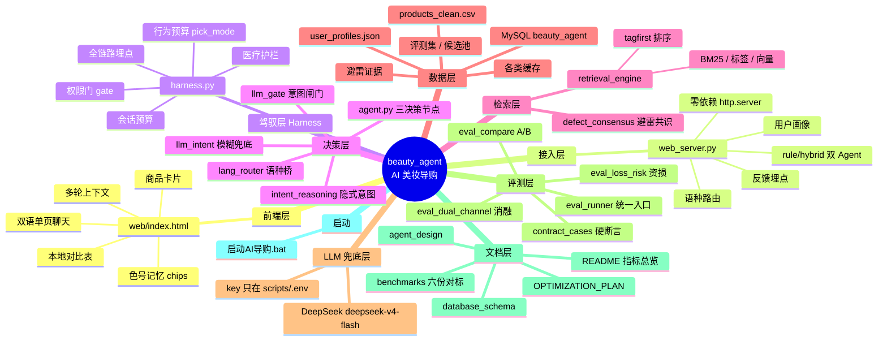

# beauty_agent 整体架构（思维导图）

> 一句话：**网页聊天 → 接入层自动路由 → 驾驭层拦一切 → 决策层判断问/答/兜底 → 检索层打标签排序 → 数据层给真相 → LLM 只在盲区兜底 → 评测层守住每一个锚点数字**。



---

## ① 前端层 · `web/index.html`（用户看见的一切）

- **双语单页聊天**（中/英，界面语言跟随用户记忆）
- 每轮请求把 `原需求 + User says: 本轮输入` 一起发给后端 → **多轮上下文不丢**
- 回复分两块：**干净版正文只留「导语 + 💡软追问」两行** + 下方**商品卡片**承载（商品名/口碑/价格）
- 本地能力：**「这三款有什么区别」对比矩阵**（命中区别/对比词 + 上轮 ≥2 款 → 前端用卡片数据拼 N 列对比表，不发后端）
- 记忆层：`localStorage` 存 `userId`；重开页面拉画像 → 记忆语言 + **时间感知问候**（24h 后再见：「还是以混油肤质为您推荐粉底液吗？」+ 两个 chip）
- 选择色号 chip、反馈按钮、清理按钮（清理对话不丢记忆）

## ② 接入层 · `scripts/web_server.py`（零依赖后端）

- 纯标准库 `http.server`，双击 `.bat` 即起，无第三方依赖
- **自动语种路由**：中文 → hybrid（规则+LLM）；英文 → rule（纯规则）；其他语种（法/阿/俄/西…）→ 翻译成英文 → rule
- 持 **rule / hybrid 两个 GuideAgent 实例**（对应二期 A/B 对照组）
- **跨会话用户画像**：`data/user_profiles.json`（语言/肤质/最近访问，上限 100 条按 last_visit 淘汰；匿名隐私）
- 接口：`POST /api/chat`、`GET|POST /api/profile`、反馈落 `data/ui_feedback.jsonl`
- 端口 8000，商品索引预热日志「✓ 商品索引已预热」

## ③ 驾驭层 · `scripts/harness.py`（Harness 管控，对 Agent 的能力加护栏）

- ① `gate()` —— **工具拦截 + 权限门**：只有「推荐/调整需求」才放行进商品库
- ② `session_budget()` —— 会话状态：时长/轮次记录，做行为预算的输入
- ③ `pick_mode()` —— **LLM 行为预算**：`SESSION_MAX_QUERIES=100`、`SESSION_MAX_LLM=20`、`SESSION_WINDOW_SEC=3600`（LLM 调用掐上限，防失控）
- ④ `medical_note()` —— **医疗越界护栏**：检测到医疗/治疗语义强制出免责声明 + `coerce_num()`
- ⑤ `data/harness_trace.jsonl` —— **全链路埋点**：每轮决策可回溯
- **现状边界（诚实，2026-09-02 措辞微调）**：`harness.py` 是**轻量管控壳**（gate/会话预算/pick_mode/医疗护栏/埋点五件套）；「工具拦截 + 置信度分支」的真身在 `llm_gate.py`（意图闸门，见 §④）；完整 Harness 管控是**目标架构方向**（用户定的演进目标），不是 harness.py 现状的全部能力

## ④ 决策层 · `scripts/`（Agent 的灵魂：什么时候问、什么时候答、什么时候认怂）

### `agent.py` —— GuideAgent 主链路，3 个显式决策节点
- `run()` 流程：① `extract_constraints` 抽约束 → ② 记忆肤质注入 → ③ `decide_ask` **追问节点** → ④ `_retrieve` 检索 → ⑤ `decide_fallback` **诚实兜底节点** → ⑥ `_build_reply` 组回复 + 证据回填
- **追问节点**：约束不完整 → 反问（ask_all / ask_first / ask_shade_soft），绝不硬推
- **诚实兜底节点**：检索空/意图不明 → 诚实告知，不编商品
- **改写重试节点**：混合模式下盲区触发 LLM 重试
- 输出**结构化决策记录**（追问/兜底/硬过滤/假命中/诚实标注/证据齐全/是否默认色号），供 CONTRACT 断言
- 双语回复层（`TAGS_EN/REASON_EN` 字典）、CJK 中文检测、`HEAT_HI/MID = 200/50` 热销分档

### `llm_gate.py` —— 对话意图闸门（Harness「工具拦截 + 置信度分支」落地）
- 先问「这句是要求推荐，还是在问别的事？」：对比/查色号/求助/闲聊 **不碰推荐器**
- **置信度分支**（用户定标）：>85% 直出 / 60%~85% 生成+人工复核徽章 / <60% 直接转人工
- **口径诚实**：三档分值为**规则预分类固定分 + LLM 自评，未做统计校准**，85/60 是工程定标阈值（demo 无真实线上分布可校准）——被追问即如实讲；说「置信度」必须指明闸门层，别与 reranker 语义试探 conf 混淆
- 事实防幻觉：对比/色号回答 =「确定性事实 + LLM 润色」，事实永远来自数据层，**绝不编评分/条数/色号/评论原话**

### `llm_intent.py` —— 模糊意图兜底（规则盲区 A/B 的 LLM 侧）
- 铁律：**规则能覆盖的绝不上模型**，只有完全盲区才调 LLM
- 强制结构化 JSON `{意图, 约束, 证据}`，但信任不用 LLM 自报置信度，用**检索兑现率**（意图映射到规范轴 + 库内商品数 ≥20 + top-8 兑现率 ≥0.5）验证
- 任一不过 → 降级回规则；超时/断连/无 key 一律降级

### `lang_router.py` —— 多语种分层路由（方案1）
- 英文 → 规则引擎（离线毫秒、确定性）；中文 → hybrid（LLM 直抽意图，保留「有点干/不要太贵」模糊表达）；其他 → LLM 翻译桥
- 铁律：**规则引擎永远是检索决策权威**，LLM 只当语言桥，绝不替规则做检索决定 → 锚点零漂移
- 语言检测纯启发式（字符范围 + 英文信号词），误判优雅降级（规则抽空 → ask_all 反问）

### `intent_reasoning.py` —— 意图识别 v13（隐藏意图推理 + query 改写）
- 显式意图（规则层）→ `explicit_intent`；**隐藏意图**（双条件触发：intent 轴 ∩ 关键词）→ `implicit_intent`；query 改写注入隐式关键词 → `query_rewrite`
- 例：防水 → 隐含防晒/SPF；消除油光 → 隐含油皮 + 哑光；保湿 → 干皮/混干
- 规则表真相源：`docs/intent_reasoning_rules.md`

## ⑤ 检索层 · `scripts/`（召回 → 路由 → 精排 → 避雷，Phase-MVP 对齐企业级链路）

### `retrieval_engine.py` —— 基础检索引擎（Phase 1）
- **三模式**：`bm25`（手写 BM25，k1=1.5/b=0.75，title+brand 英文文档）/ `tag`（标签匹配分，知识分层：肤质/妆效/遮盖/质地/色号 + 隐式意图）/ `vec`（bge-small-en-v1.5 向量，预留接口）
- **tagfirst 排序 = 现行正式排序**：`(ts=标签分, heat, bm25)` 字典序降序——**ts 绝对主序**、heat 同分内质量排序、bm25 文本兜底
- **heat = 评分 × (1 + 评论量加成)**（评论数 >10 → +0.5；≥50 → +0.5；≥200 → +1.0）——「评分 × 评论量」自带 anti-冷门
- 硬约束过滤（tag_score 硬排除）+ 置信度降权（title 推断轴贡献 ×0.5）+ 路由偏置
- 隐式意图映射表（防晒/防水持妆/油皮控油/哑光妆效/干皮保湿）

### `recall_router.py` —— 多路召回 + 路由分流（MVP 2026-09-01）
- **四路召回**：字段（硬约束通过全集）/ 文本（BM25 top-K）/ 热销（heat top-K）/ 语义（向量 top-K，bge 未加载自动降级）
- **动态路由**（D 通道口径）：有结构化约束（含隐式意图）→ tagfirst；无约束 → 语义通道（BM25+向量）
- **route_trace** 随 record 落 `harness_trace.jsonl`（各路由多少、走哪个通道，可观测）

### `ranker.py` —— 精排器接口 + 行为模型预留位
- `ColdStartRanker`：现行唯一可用精排 = tagfirst（无行为信号的冷启动口径）
- `BehaviorRanker`：**预留位**——行为模型（CTR/GMV/LambdaRank）双塔接口已定、特征清单已列，未训练；换精排只改 `config.RANKER` 一行，无模型安全降级冷启动

### `defect_consensus.py` —— 评论负面反馈 → 避雷共识（用户定标 70% + 2026-09-02 补样本下限）
- **分母口径（注释写死）** = 该商品负面评论总数（`n_neg_reviews`），不是含好评的全部评论
- **样本下限**：该商品负面评论 **≥5 条**（`config.DEFECT_MIN_NEG`）才参与比例判定；1~4 条偶发差评直接不避雷（防单条差评误杀小评论数商品）
- 某缺陷轴提及数 ÷ 该商品负面评论总数 ≥ **70%**（`config.DEFECT_CONSENSUS`）→ 硬规则，命中即避雷
- 避雷轴 ∈ {卡粉, 脱妆, 闷痘, 刺激, 油腻}；色号偏深/偏浅 = 适配问题，永不进避雷
- 被 agent.py（运行时硬过滤）与 build_avoid_set.py（负候选打分）共用；**旧口径归档 `legacy_consensus_axes()`** 供消融对比（阈值单一真相源在 `config.py`）

### `config.py` —— 全局配置单一真相源（对齐 pangu 方案配置/运营调优）
- 热销分档 / 避雷阈值 / 会话预算 / 画像上限 / 语义权重 / 召回路 top-K / 精排器选择——可调参数收拢一处，可改、可审计、可回滚

### `store.py` —— 存储接口抽象（2026-09-01，对齐 pangu 存储层「接口在前、实现在后」）
- `KVBackend` 抽象基类（get_all/save_all）→ `JsonKVBackend`（JSON 文件实现，现行）→ `RedisKVBackend`（预留位，部署传 redis 客户端即切换）
- `ProfileStore`（画像 get/touch + LRU 淘汰）承接 web_server 的画像读写，**锁语义不变**（锁在 web 层，store 内不加锁）
- **换存储不换业务代码**：web_server 只做薄委托，Redis 上线只改构造一行

### `dashboard.py` —— 数据看板（2026-09-01，可观测收口）
- 读 `data/harness_trace.jsonl` 全链路埋点 → 聚合 → 自包含静态页 `data/dashboard.html`（零第三方库，双击浏览器打开）
- 检索耗时分布 / 路由通道分布 / 追问·兜底·降级率 / 意图·语言 / 预算护栏 / 热推 Top-10；事件行单独计拒绝/错误
- 设计语言：明亮风 SaaS 中后台（浅紫蓝渐变 + 白面板 + 主色 #4F6BFF + 状态胶囊）

演进路线见 [`docs/enterprise_evolution.md`](docs/enterprise_evolution.md)（行为精排 BehaviorRanker 从冷启动 → LambdaRank 双塔的完整路线）。

## ⑥ 数据层 · `data/` + MySQL

### 商品与证据
- `products_clean.csv` —— 主商品库（**1090 款**，asin/标题/品牌/价格/评分/评论数/肤质/妆效/遮瑕/质地/色号/冲突标记…，来源 McAuley Amazon Reviews）
- `product_defect_evidence.csv` —— 差评轴证据（parent_asin / defect_scores / n_neg_reviews）
- `review_scores.csv`、`products_clean_sim.csv`（相似度）

### 评测集与候选池（评测真相源 = MySQL `eval_review_50`；CSV 分「源文件 / 遗留 / 快照」，完整清单与行数核对见 [data/README.md](data/README.md)）
- MySQL `eval_review_50` —— **200 行**（41 锚点 v2 + 159 v3 ids 42-200），评测集唯一真相源
- `_v3_eval_full.csv` —— **159 行 v3 三轨源文件**（88 好评 + 32 模拟 + 39 差评）
- `eval_review_50.csv` —— **v1 遗留 11 行样例**（勿当 MySQL 200 行快照）
- `evaluation_set.csv` / `eval_queries.csv` / `eval_queries_all.csv` —— Phase-1 评测源
- `candidate_pool_v2.csv` —— **10702 行 / 200 题**（池内首答/NDCG 口径）
- `candidate_pool.csv` —— Phase-1 池 617 行（gold+50 负候选）
- `human_gold_check.csv` —— 人工复核记录（q7 gold 重标、badcase 复核）

### 运行时状态
- `user_profiles.json` —— 跨会话用户画像
- `llm_cache.json` / `title_translation_cache.json` / `translate_cache.json` —— LLM/翻译缓存（省调用、降延迟）
- `harness_trace.jsonl` —— 全链路埋点
- `ui_feedback.jsonl` —— 前端反馈

### 报告产物（可随时重跑，非真相；生成脚本见 data/README.md）
- `eval_report.csv`（锚点回归）/ `eval_v3_report.csv`（v3 四维）/ `ablate_v3_report.csv` / `dual_channel_report.csv`（12 通道）/ `sem_probe_report.csv` / `loss_risk_report.csv` / `badcase_report.csv` / `quality_report.md`

### MySQL `beauty_agent` 库
- 与 CSV 同源真相库（`eval_review_50` 等表），`db_config.py` 统一凭据（**scripts/.env，仓库零明文密码**）

## ⑦ LLM 兜底层 · DeepSeek

- 模型：`deepseek-v4-flash`（便宜快，兜底场景够用）
- **DEEPSEEK_API_KEY 只存 `scripts/.env`**，绝不硬编码/不落盘到代码/文档/记忆/缓存（.gitignore 已挡）
- 只做三件事：中文意图直抽、盲区意图兜底、对比/求助/闲聊润色——**检索决策永远在规则侧**

## ⑧ 评测层 · `scripts/eval_*.py`（锚点回归的守门员）

- `eval_runner.py` —— **统一评测入口**：一个命令出全部关键数字（CONTRACT 105/105、首答、NDCG、系统层耗时）+ 自动对比上轮标记回归
- `contract_cases.py` —— **24 题硬断言**：测决策正确性（追问/兜底/硬过滤/假命中/诚实标注/证据齐全/不默认色号），105 条全过
- `eval_agent.py` —— 24 题 CONTRACT 跑批：3 决策指标（追问率/降级率/兜底率）+ 软指标（首答/避雷）
- `eval_compare.py` —— **二期 A/B**：规则 A vs 规则+LLM 兜底 B（hidden 9 题 B 组 7/9 命中、锚点零漂移）
- `eval_loss_risk.py` —— **资损陷阱题** 8/8 全过（架构级回归门，CI 可挂）
- `eval_pool_v2.py` —— v2 候选池内首答命中率
- `eval_retrieval.py` —— Phase-1 四模式消融（Recall@5/MRR/NDCG@5/避雷）
- `eval_dual_channel.py` —— **12 通道消融**（结构化/语义/双路由/交叉编码器/加权融合/trust 接线 ×5 → 证伪 A 唯一最优）
- `eval_report_grid.py` —— 报告模板（对标 benchmark_06）
- `diag_anchor_drift.py` / `diag_system_layer.py` —— 锚点漂移 / 系统层诊断

### 锚点数字（每次改动必须逐数字复现）
| 指标 | 值 |
|---|---|
| 首答命中率 | **18/19 = 94.7%** |
| NDCG@5 | 0.553（Phase-1 口径） |
| 避雷率 | 0.889 |
| CONTRACT | **105/105** |
| 追问率 / 降级率 / 兜底率 | 29.2% / 0% / 8.3% |
| 资损 | **8/8** |
| 二期 A/B（hidden 9 题） | B 组 7/9 命中，锚点零漂移 |
| 通道消融 | A(ts,heat,bm25) 94.7% = 唯一最优；H3 89.5% 最接近但 q22 证伪 |

## ⑨ 数据构建脚本层 · `scripts/`（只读/离线，不进运行时）

- **商品清洗**：`clean_products.py`（原表→1090 款干净表）、`shade_tag_extract.py`、`coverage_extract.py`、`enhance_extras_implicit.py`、`sim_label_patch.py` / `apply_label_patch.py` / `retest_phase1_tagfirst.py`（标签工程闭环）
- **评测集构建**：`extract_queries.py` → `build_eval_set.py` → `augment_eval_set.py` → `add_hidden_intent_cases.py` → `calibrate_gold.py` → `relabel_q7_gold.py` → `prep_human_gold_check.py`（人工复核流水线）
- **候选池/避雷集**：`build_candidate_pool.py` / `build_candidate_pool_v2.py`、`build_avoid_set.py`、`sync_avoid_review.py`、`sync_review_scores.py`
- **意图/翻译**：`intent_reasoning.py`、`translate_titles.py`
- **MySQL 导入**：`load_mysql.py` / `load_review_mysql.py` / `load_eval_mysql.py` + `db_config.py`
- **反馈闭环**：`feedback_to_eval.py`（前端反馈 → 评测用例）
- **工具**：`download_bge.py`、`parallel_download.py`（大文件多线程分段下载）、`grid_scan.py`（参数网格扫描）

## ⑩ 文档层 · `docs/` + 根目录

- `README.md` —— 架构总览 + 指标表（对外门面）
- `docs/OPTIMIZATION_PLAN.md` —— **主优化计划 Phase0-4**（改/推进项目先看）
- `docs/agent_design.md` —— 智能体设计文档（含 §8.9-8.19 每轮实测交付记录）
- `docs/database_schema.md` —— **数据库 schema 真相源**（改表/改指标强制同步）
- `docs/metrics_glossary.md` —— **指标口径字典**（每个指标的分母与坑，防「94.7% 分母是几」被反问）
- `docs/label_pipeline.md` —— 商品五维标签生产链路与 QA（覆盖度量 36.2% 等的单一出处）
- `data/README.md` —— 数据/评测资产真相源清单（文件行数核对唯一依据）
- `docs/dual_channel_analysis.md` —— 12 通道消融全量分析（§1-12）
- `docs/intent_reasoning_rules.md` —— 意图推理规则表（领域知识真相源）
- `docs/retrieval_phase1A.md` / `retrieval_phase1B.md` —— 检索层阶段设计
- `docs/ec_commercial_narrative.md` —— 电商商业叙事
- `docs/eval_v2_batch1-4.md` / `eval_item_sample.md` / `eval_report_analysis.md` / `eval_review_checklist.md` —— 评测记录
- `docs/benchmarks/` —— **六份对标文档**（Amazon C4 Blair / ESCI / Beauty-steerable / RAG-ecommerce / RAG-customer-service / SpringAI 跨境）

## ⑪ 启动层 · `启动AI导购.bat`

- 双击即启动（用 `py` 非 `python` 回退链、CRLF 行尾），自动起后端 + 打开浏览器 → 本地可演示

---

## 架构分层调用关系（数据流）

```
用户输入
   │
   ▼
[前端 web/index.html] ──多轮上下文+userId──▶ [接入层 web_server.py] ──语种路由──▶ [lang_router.py]
                                                                                  │
                                            ┌─────────────────────────────────────┴──────────┐
                                            ▼中文hybrid / 英文rule / 其他翻译桥                 ▼
                                     [驾驭层 harness.py] ◀────── gate()/预算/护栏/埋点     [决策层 agent.py + llm_gate + llm_intent]
                                            │                                                │ decide_ask/兜底/改写重试
                                            ▼                                                ▼
                                     [检索层 retrieval_engine + defect_consensus] ◀── 标签分/BM25/热销/避雷硬过滤
                                            │                                                │
                                            ▼                                                ▼
                                     [数据层 data/ + MySQL beauty_agent] ◀──── 商品库/评测集/候选池/画像/缓存
                                            │                                                │
                                            ▼ 只在规则盲区调，key 在 scripts/.env              ▼
                                     [LLM 兜底 deepseek-v4-flash] ◀────────────── 中文直抽/盲区意图/润色
                                            │
                                            ▼
                                     [评测层 eval_*.py] ── 锚点 94.7% / 105/105 / 资损 8/8 回归门
```

> 独立性声明：本文件只读梳理项目结构，未修改任何代码与数据；锚点数字以 `eval_runner.py` / README 口径为准。
