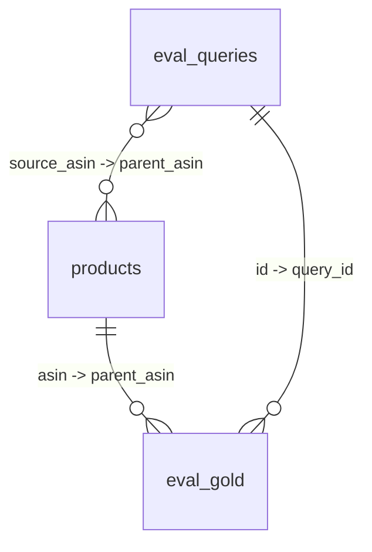

# beauty_agent 数据库 Schema 文档

> **维护规则（强制）：** 任何对 `beauty_agent` 库的建表 / 改字段 / 改指标 / 改标签，**必须同步更新本文件**。本文件是数据库的"真相源"，DBeaver 里看到的任何结构都要能在这里找到解释。
>
> 最近更新：2026-08-29（badcase 优化：**q7 gold 重标**——primary EX1 Invisiwear（实际中度遮瑕/遮瑕未标）换 **B08SW7WZPX**（液体/全肤质;敏感肌/哑光/高遮瑕，不在缺陷证据表），extras 去掉缺陷商品 Dermacol（闷痘:4）/Clinique（色号偏深黄:3）换 **B00GCQZB00**（乳霜/全肤质/哑光/高遮瑕）；双表 UPDATE（备份 bak_v19）+ 重建池，首答 **17/19→18/19=94.7%**，NDCG 0.553/避雷 0.889/CONTRACT 105/105/3 决策指标全零回归，坏例 5→4。**Phase-1 池 q7/q9/q11 避雷泄漏经实测为池内子集伪影**——负例商品 Agent 全库排序 28/139/73 名、生产不推，缺陷预过滤清不掉（弱证据未过 70% 共识 + q7/q9 无避雷轴），用户拍板跳过暂不改）｜ 版本：v18

**v12**（shade_tag 色号标签提取（64.9% 覆盖）——为色号 query 建地基；**避雷集升级 v2**：negative 从 v11「缺陷证据反推」升级为「**意图相反标签匹配**」，避雷商品必须能从可见标签自证（要高遮瑕→避轻遮瑕、要白皙→避深色、要控油→避水光/光泽），缺陷证据降级为无相反标签轴的兜底；修复 fair share 习语误判）

## 1. 连接信息

| 项 | 值 |
|---|---|
| Host / Port | `localhost` / `127.0.0.1:3306` |
| 数据库 | `beauty_agent` |
| 用户名 / 密码 | `root` / 见 `scripts/.env`（BEAUTY_DB_USER / BEAUTY_DB_PWD） |
| 字符集 | utf8mb4 |
| 查看工具 | DBeaver |

## 2. 表清单与关系

| 表 | 行数(2026-08-25) | 职责 | 关联键 |
|---|---|---|---|
| `products` | 1,090 | 商品知识库主表（干净粉底液，已排除 bundle/妆前乳） | 主键 `parent_asin` |
| `quality_metrics` | 17 | 数据质量指标（键值对） | 无 |
| `tag_distribution` | 27 | 分类标签体系分布（+5 个色号桶） | 无 |
| `eval_queries` | 11 | 评测集 Query 主表（仅 need 搜索需求句；v13 加显式/隐藏意图 + 改写 4 字段） | `id` 主键 |
| `eval_gold` | 67 | 金标准明细（Query→商品一对多；8 primary + **32 extra**（27 四维 + 5 隐式）+ 27 negative） | `query_id`→`eval_queries.id`，`asin`→`products.parent_asin` |
| `eval_review_50` | 41 | 人工一致性复核表（评测集 v2：24 条锚点题 + **9 条隐式意图题 ids 25-33**（2026-08-28 二期实验新增）+ **8 类各补 1 条 ids 34-41**（2026-08-29 第四批补题冲量）） | `id` 自增行号（无外键） |
| `对比表1` | 41 | eval_review_50 的副本，人工复核对照用（同步重建） | 同 eval_review_50 |
| `candidate_pool` | 617 | **候选池（Phase 0 收尾，对标 C4）**：每 Query 金标准全量 + 50 负候选（难例15/随机35），NDCG 在池内计算避免全库排序虚高 | `query_id` 对应 eval_queries 行号，`asin`→`products.parent_asin` |
| `candidate_pool_v2` | 2249 | **v2 候选池（2026-08-29 重建）**：41 题（24 锚点 + 9 隐式意图 + 8 补题）× 候选池（锚点题池逐行恢复原始保证首答复现；新增题难例/随机分层；**q7 重标后 2250→2249**：q7 gold 6→5 asin）。与 candidate_pool 同方法学，轴从 Agent `extract_constraints` 推导 | `query_id` 对应 eval_review_50.id，`asin`→`products.parent_asin` |



---

## 3. products —— 商品知识库主表

**来源：** Amazon All Beauty 元数据清洗后，只保留面部粉底液（foundation/bb cream/cushion），排除工具/散粉/妆前等噪声。清洗漏斗见 `quality_metrics`。

| 字段 | 类型 | 含义 / 取值说明 |
|---|---|---|
| `parent_asin` | VARCHAR(20) **PK** | 商品族 ID，**与评论表的关联键**（原 `asin` 字段全库为空已删除） |
| `title` | VARCHAR(1000) | 商品标题 |
| `brand` | VARCHAR(200) | 品牌：优先 `details.Brand`，兜底 `store`（store 常是批发商，需注意） |
| `brand_clean` | TEXT | 品牌清洗候选（留给后续人工校验） |
| `price` | DOUBLE | 价格（USD）。**缺失率 77.2%**，双轨策略处理（有价→报价/过滤；无价→降权+实时查询引导） |
| `average_rating` | DOUBLE | 平均评分（1-5） |
| `rating_number` | BIGINT | 评论数（热度信号） |
| `item_form` | TEXT | 质地：`液体 / 乳霜 / 粉状 / 棒状 / 气垫`（details 优先 + title 兜底） |
| `skin_type` | TEXT | 肤质描述（原文，如 `Oily` / `Dry, Combination`） |
| `finish_type` | TEXT | 妆效描述（原文，如 `Matte` / `Dewy`） |
| `item_form_source` | TEXT | 字段来源：`details` / `title`（推断）/ `missing` —— **置信度标记** |
| `skin_type_source` | TEXT | 同上 |
| `finish_type_source` | TEXT | 同上 |
| `coverage` | TEXT | 遮瑕度原文：`Light` / `Medium` / `Full` |
| `skin_tone` | TEXT | 肤色（缺失率 93%） |
| `scent` | TEXT | 香味（缺失率 100%） |
| `benefits` | TEXT | 功效描述 |
| `uses` | TEXT | 推荐用途 |
| `color` | TEXT | 色号 |
| `unit_count` | TEXT | 规格/数量 |
| `category_tag` | TEXT | 分类标签：固定 `底妆/粉底液` |
| `form_tag` | TEXT | 质地标签（中文）：`液体/乳霜/粉状/棒状/气垫` |
| `skin_tag` | TEXT | **肤质主标签**（单一，展示/分布用） |
| `skin_tags` | TEXT | **肤质多标签**（分号分隔，评测匹配用）—— 复合肤质改造 |
| `finish_tag` | TEXT | 妆效标签（中文）：`哑光/水光/光泽/自然/缎面` |
| `coverage_tag` | TEXT | 遮瑕标签：`高遮瑕/中度遮瑕/轻遮瑕`（2026-08-27 `coverage_extract.py` 自动提取补至 **381/1090=35%**：coverage 原文 18 + 标题关键词 73；2026-08-28 ②精标 `apply_label_patch.py` 人工补空 **14 个**，落地 395/1090=36.2%，未标 695 靠 Agent 诚实规则兜底，见 7.5 节） |
| `coverage_tag_source` | VARCHAR(10) | **遮瑕标签来源（2026-08-27 新增，对齐 `*_source` 降权机制）**：`field`（coverage 原文字段，高置信全权重）/ `title`（标题关键词推断，检索引擎遮盖轴 ×0.5 降权）/ `manual`（②精标人工核对，全权重，2026-08-28 新增）/ 空（未标） |
| `conflict_skin` | TINYINT(1) | 肤质冲突标记（title 说 oily 但 details 写 Dry → 1） |
| `conflict_finish` | TINYINT(1) | 妆效冲突标记（title 说 matte 但 details 写 Dewy → 1） |
| `shade_tag` | VARCHAR(100) | **色号多标签（v12 新增）**：从标题提取，分号分隔可多桶：`白皙/自然/橄榄/深色/冷调`。标题是「家族主打色系」信号，非全色号范围；无词命中为空串（64.9% 覆盖） |

### 肤质标签取值字典（`skin_tags` 多标签）

| 原始值 | 标签 | 说明 |
|---|---|---|
| `All` / `Universal` / `all skin` | `全肤质` | 适用所有肤质 |
| `Sensitive` | `敏感肌` | **硬约束**：Query 含此标签，候选必须适用 |
| `Acne` / `breakout` | `痘痘肌` | **硬约束**：同上 |
| `Oily` 单独 | `油皮` | 软偏好 |
| `Dry` 单独 | `干皮` | 软偏好 |
| `Combination` 单独 | `混合肌` | T区油两颊干（中性表述） |
| `Oily, Combination` | `混油` + `混合肌` | 偏油混合 |
| `Dry, Combination` | `混干` + `混合肌` | 偏干混合 |
| `Normal` | `中性` | 软偏好 |
| `Mature` | `熟龄肌` | 软偏好 |

---

## 4. quality_metrics —— 数据质量指标

键值表：`metric`（指标名） + `value`（数值）。**清洗漏斗 + 数据问题清单。**

| metric | value | 含义 |
|---|---|---|
| `全库商品数` | 112590 | meta 全库商品总数 |
| `标题命中粉底液关键词` | 2301 | 标题含 foundation/bb cream/cushion |
| `排除工具/非粉底液后` | 1117 | 排除刷/粉扑/散粉/妆前等噪声后 |
| `排除 bundle/妆前乳` | 27 | v10 新增：makeup base（妆前乳）+ bundle（套装）混入标题 → 排除（净减 27） |
| `按 parent_asin 去重后` | 1090 | **最终商品数**（v10 重构后） |
| `价格缺失数` | 838 | 无 price 的商品数 |
| `价格缺失率%` | 76.9 | **核心问题**：Amazon 元数据结构性缺失（2018/2023 版均 15-22%） |
| `肤质缺失数` | 679 | 无 skin_type |
| `肤质缺失率%` | 62.3 | title 兜底仅补 7 条（title 极少写明肤质） |
| `妆效缺失数` | 489 | 无 finish_type |
| `妆效缺失率%` | 44.9 | title 兜底补 111 条 |
| `遮瑕度缺失率%` | 71.6 | coverage 缺失 |
| `肤质冲突数` | 1 | title 与 details 肤质冲突（置信度需人工复核） |
| `妆效冲突数` | 4 | title 与 details 妆效冲突 |
| `重复标题数` | 30 | 不同商品但标题相同 |
| `品牌完整度%` | 89.4 | brand 完整度 |
| `色号标签覆盖数` | 707 | **v12 新增**：标题命中色号词的商品数（color 字段缺失 93%，标题是主要色号信号源） |
| `色号标签覆盖率%` | 64.9 | v12：色号可标注商品占比 |

---

## 5. tag_distribution —— 标签分布

键：`tag_type`（标签类型）+ `tag`（标签值）+ `count`（商品数）。五个类型：

| tag_type | 取值示例 |
|---|---|
| `category_tag` | 底妆/粉底液：1090 |
| `form_tag` | 乳霜/液体/粉状/气垫/棒状 |
| `skin_tag` | 全肤质/敏感肌/油皮/干皮/混油/混合肌/中性 |
| `finish_tag` | 哑光/自然/光泽/缎面/水光 |
| `coverage_tag` | 高遮瑕/中度遮瑕/轻遮瑕 |
| `shade_tag`（v12） | 自然441/白皙247/深色104/冷调98/橄榄54（一个商品可多桶，2026-08-27 核对修正：原误写白皙441） |

---

## 6. eval_queries —— 评测集 Query 主表

**来源：** 从真实用户评论抽取的需求表达（非人工编造），**v10 起只保留 `need` 搜索需求句**（`query_type` 分层，见下），11 条。

> **v10 根因修复**：评论句 ≠ 搜索需求句。此前把「它让我的皮肤很光滑」这类体验反馈句当搜索需求句，primary/extras 金标准必然失真。现在只有 `need` 句进入评测集并生成金标准；`experience` 保留在 `eval_queries_all.csv` 作分析，`weak` 统计后剔除。

| 字段 | 类型 | 含义 |
|---|---|---|
| `id` | BIGINT | Query 主键 |
| `query` | TEXT | 真实用户需求文本（原句） |
| `query_type` | TEXT | **v10 新增**：`need`（搜索需求句，唯一进评测集）/ `experience`（体验反馈句，仅 eval_queries_all.csv）/ `weak`（弱句，统计后剔除） |
| `query_level` | TEXT | 质量分级：`high`（命中搜索动词，更像真实客服咨询口吻）/ `mid` |
| `complexity` | TEXT | 复杂度：`short`（<70字）/ `medium`（70-150字）/ `complex`（≥150字 或 ≥100字+复合条件）—— 对标 Amazon-C4 难度分层 |
| `intent` | TEXT | **v10 多轴多标签**（分号分隔，一个 query 可命中多轴）：`避雷防刺激;肤质;妆效;遮盖力;质地肤感;持妆;色号;保湿;控油;性价比;其他` |
| `difficulty` | TEXT | 难度：`easy/medium/hard` = complexity + 复合条件（intent 轴数≥3 或复合肤质）提档 |
| `skin_label` | TEXT | 肤质多标签（英文分号分隔）：`oily;dry` / `sensitive;combination_dry` 等 |
| `finish_label` | TEXT | 妆效（英文）：`matte/dewy/glow/...` |
| `coverage_label` | TEXT | 遮瑕（英文）：`full/medium/light/sheer` |
| `form_label` | TEXT | **v10 新增**：质地（英文）：`liquid/cream/powder/stick/cushion`（extras 质地轴匹配用） |
| `source_asin` | TEXT | 来源商品（该 Query 抽自哪条评论对应商品） |
| `source_rating` | DOUBLE | 来源评论评分（≥4 → 有正例；≤2 → 归避雷负例） |
| `explicit_intent` | TEXT | **v13 新增**：显式意图（规则层 10 轴多标签，即 `intent` 列语义，兼容保留） |
| `implicit_intent` | TEXT | **v13 新增**：**隐藏意图**（分号分隔）——场景归因/属性多面性/功效关联，如 `防晒/SPF;防水持妆`。推理规则见 `docs/intent_reasoning_rules.md` |
| `intent_source` | TEXT | **v13 新增**：意图来源：`rule`（规则推理）/ `llm`（LLM 推理，预留策略位）/ `rule;llm`（双路一致）/ `none`（未命中） |
| `query_rewrite` | TEXT | **v13 新增**：改写后 query（对齐 pangu_search_qp `revise`）：原句归一化 + 隐式关键词句末注入，供检索扩展召回 |

**v13 意图识别双层架构**（规则为主 + LLM 预留）：
1. **规则层（现有）**：`intent` 10 轴多标签 → `explicit_intent`（显式）
2. **推理层（v13）**：领域知识规则表（强信号单条件 / 弱信号双条件）→ `implicit_intent`（隐藏意图，用户表达是症状，反推需求）
3. **策略位**：`intent_source` 预留 `llm`——规则未覆盖时走 LLM 零样本推理，双路可对照（对齐 FABRIC/SSUF 调研）

**覆盖统计（v13）**：11 条 need query 中 6 条命中隐藏意图——熟龄肌×1（id=1）、干皮/混干×2（id=4/5）、油皮/混油+哑光+轻薄×1（id=7）、防晒/SPF+防水持妆×1（id=9）、轻薄质地×1（id=11）。

---

## 7. eval_gold —— 金标准明细

**Query→商品 一对多**，是评测集核心。相关度分级：

| 字段 | 类型 | 含义 |
|---|---|---|
| `query_id` | BIGINT | → `eval_queries.id` |
| `asin` | VARCHAR(20) | 金标准商品 → `products.parent_asin` |
| `relevance` | DOUBLE | 相关度：**1.0** primary / **0.8** extra / **-1.0** negative |
| `gold_type` | TEXT | `primary`（来源好评商品，相关1.0）/ `extra`（属性标签匹配，相关0.8）/ `negative`（避雷，相关-1） |

### 金标准生成逻辑

1. **primary**：Query 来源评论对应的商品，且评分≥4（用户满意 → 相关度 1.0）
2. **extra（v13 双路，两路都是 0.8）**：
   - **显式四维匹配**（v10 升级）：肤质 `skin_tags` 多标签 + 妆效 `finish_tag` + 遮瑕 `coverage_tag` + 质地 `form_tag`
     - **硬约束**（敏感肌/痘痘肌必须适用）+ **软偏好**（肤质命中+2、全肤质+1、妆效+2、遮盖+1、质地+1）
     - **多样性去重**（v10）：同一品牌限 1 个；「只靠全肤质命中」的通用品限 1 个 → 修复热门聚集/清一色全肤质刷屏导致的假正例
     - 按匹配分 + 评分排序取 Top5（相关度 0.8）→ 存 `gold_extras`
   - **隐式意图驱动增补**（v13 新增）：`implicit_intent` 命中后按隐式维度补推商品 → 存 `gold_extras_implicit`
     - `防晒/SPF` → title 含 SPF/sunscreen；`哑光妆效` → `finish_tag=哑光`；`油皮/混油肤质`/`干皮/混干肤质` → `skin_tags` 命中
     - **无对应标签维度时诚实跳过**（熟龄肌/轻薄质地 products 表无此轴，不伪造维度）
     - 同品牌限 1、热度排序、排除已占商品；每 query 每维度补 1 个、最多补 2 个
     - **独立列存**（`gold_extras_implicit`/`gold_extra_implicit_reason`）：来源可审计（显式 vs 隐式）、幂等可重跑，不污染用户已复核的四维 extras
3. **negative**：**v12 升级为意图相反标签匹配避雷集**（对标 benchmark03 的 `avoid_target` 负偏好语义）——识别 query 意图轴 → 找带「相反标签」的商品（要高遮瑕→避轻遮瑕、要白皙→避深色、要控油→避水光/光泽），无相反标签的轴退回缺陷证据兜底；不再「来源差评商品」（旧逻辑 2 条粗负例）

> **v13 隐式增补 5 个商品**：id=4/5 干皮→Boots No7（干皮标签）、id=7 油皮+哑光→Boots No7 + Rimmel Stay Matte（油皮/哑光标签）、id=9 防晒→bareMinerals SPF 15。**价值示例**：id=9「去 Cancun 要防水防晒」显式四维全部落空（无肤质/妆效/遮盖/质地信号），仅靠隐式防晒补上 SPF 商品——只做显式四维，防晒需求全漏。

### 避雷集构建逻辑（v12）

> **v12 根因（用户人工复核驱动）**：v11 用「评论缺陷证据」反推避雷商品，但避雷商品的**自带标签**与 query 意图对不上（如"要色号"却给混油标签商品）→ 人工复核判 1 分。用户结论：**避雷 = 用户意图的相反面**，避雷商品必须能从可见标签一眼自证「为什么不该推它」。

| 环节 | 做法 |
|---|---|
| **意图相反标签匹配（主）** | 识别 query 意图轴 → 找带「相反标签」的商品：要高遮瑕→避 `coverage_tag=轻遮瑕`；要白皙→避 `shade_tag=深色`；要深色→避 `shade_tag=白皙`；要控油→避 `finish_tag=水光/光泽`。色号意图中性（只要"合适的色号"）→ 色号轴不避 |
| **色号方向识别** | query 含 pale/fair/ivory/porcelain…→ 要白皙；含 dark/deep/tan…→ 要深色。**排除习语/语境误判**：`fair share`（"经历很多"）、`light coverage` 不是色号方向 |
| **缺陷证据兜底（次）** | 无相反标签的属性轴退回评论缺陷证据：避雷防刺激→闷痘/刺激；持妆→脱妆；质地肤感→卡粉（评分加权 1-2星×3/3星×2/4星×1/5星×0；否定感知 `doesn't crease`/`non-greasy` 是好评不计数） |
| **排序** | 标签相反命中（强信号，每轴+5）优先于缺陷证据；同品牌限 1（防热门聚集假负例）；排除 primary/extra 已占商品（矛盾约束）；取 Top3 → 相关度 -1.0 |

**数据**：评论库 3881 条 → 195 商品有缺陷证据（17.9%，兜底用）；27 个 avoid 商品覆盖 9 条 query（id=1/2/3/5/7/8/9/10/11，id=4/6 无相反标签可避）。**标签自证样例**：要白皙（id=2/8/10）→ 避 bareMinerals Golden Tan / Demure Dark Warm / L.A.girl（全部带 `深色` 桶标签）；要高遮瑕（id=1/3/5）→ 避 Tarte / ION DE CUSHION / IMVELY（全部 `轻遮瑕`）。证据明细落盘 `data/product_defect_evidence.csv`（`defect_axes` / `defect_scores` / `n_neg_reviews` / `evidence_score` 四列，可审计）。

### 评测指标定义（待落 eval_guide.md）

| 指标 | 定义 | 涉及表 |
|---|---|---|
| 首答准确率 | Agent 首句回复是否命中 `gold_primary` | eval_gold(primary) |
| NDCG@5 | 推荐列表排序质量，gain 用 relevance(1.0/0.8) | eval_gold |
| 避雷准确率 | 避雷 Query 中 Agent 未推荐 `gold_negative` 的比例 | eval_gold(negative) |

---

## 7.5 eval_review_50 —— 人工一致性复核表

**用途**：人工复核自动金标准是否合理 → 算「自动 vs 人工一致性率」，量化验证自动生成金标准的可靠度（不是自说自话可解释，而是有数字背书）。

**v2 重建（2026-08-27）**：评测集 v2 定稿后，两表已重建为 **24 条交互式标准答案题**（8 类全覆盖：直说3+模糊3+避雷3+色号3+预算3+持妆3+硬约束3+质地3），清空段 A/B 旧 11 条及残留试打分。gold 三列改为存**商品名（价格·评分/评论数）🔗asin [质地:… | 肤质:… | 妆效:… | 遮瑕:… | 色号:…]**（多商品用 ` || ` 分隔），全部 asin 可在 products 表检索；`query_level` 存来源（`真实`=真实 need 升级 / `模拟`=模拟客服咨询场景）。评分三列已重置为 NULL，待用户在 DBeaver 人工复核填分。

**gold 标签标注（2026-08-27，人工复核辅助）**：用户不熟悉商品，评分时需一眼看清每个商品的**功能/妆效/色号**——gold 三列每个 asin 末尾已按 `products` 表标签追加五轴标注块 `[质地:form_tag | 肤质:skin_tags | 妆效:finish_tag | 遮瑕:coverage_tag | 色号:shade_tag]`，缺标签的轴写 `未标`（质地缺 7% / 色号 26% / 妆效 28% / 肤质 46% / 遮瑕 75%，遮瑕轴库内覆盖最低）；`未标` ≠ 不适用，是库内无该轴信息。两表已同步更新且逐字段一致（0 差异）。

| 字段 | 类型 | 含义 |
|---|---|---|
| `id` | INT **PK** | 自增行号（1-24，对应 v2 各题） |
| `query` | TEXT | 原始 Query |
| `query_zh` | VARCHAR(500) | Query 中文翻译（人工复核便于理解） |
| `query_type` | TEXT | v2 八类：直说/模糊/避雷/色号/预算/持妆/硬约束/质地 |
| `query_level` | TEXT | 来源：`真实`（真实 need 升级）/ `模拟`（模拟客服咨询） |
| `complexity` | TEXT | 复杂度：short/medium/complex |
| `intent` | TEXT | 意图轴多标签（分号分隔） |
| `difficulty` | TEXT | 难度：easy/medium/hard |
| `gold_primary` / `gold_extras` / `gold_negative` | TEXT | 标准答案推荐/备选/避雷商品，格式「商品名（价格·评分/评论数）🔗asin [质地:… | 肤质:… | 妆效:… | 遮瑕:… | 色号:…]」，多商品用 ` || ` 分隔（末尾标签块为人工复核辅助标注） |
| `primary_ok` / `extras_ok` / `negative_ok` | TINYINT | **人工判断列（1-6 分制）**：1=非常不准确 / 2=不太准确 / 3=一般 / 4=比较准确 / 5=很准确 / 6=无法判断；对应 gold 列为空时不填。一致性率 = 打 4/5 分的占比（排除 6）；另报无法判断率与平均分 |
| `notes` | TEXT | 判断要点 / 追问设计 / 诚实兜底说明 |

**二期扩表（2026-08-28，ids 25-33）**：新增 **9 条隐式意图题**（`query_type` = `隐式意图`），gold 三列标注块格式与既有题一致，由 `scripts/add_hidden_intent_cases.py` 一次性双表迁移落库（已备份 `eval_review_50_bak_v16` / `对比表1_bak_v16` 可回滚）。9 条措辞逐一过**规则盲区验证门**（`extract_constraints` → implicit 空 + control_oil False + infer_implicit 全空）——这些题是纯规则一条都答不了的盲区，正是二期 A/B 实验（规则 vs 规则+LLM 兜底）的考题，详见 §7.9。

**一致性率计算**：用户在 DBeaver 填分后，用 `scripts/sync_review_scores.py`（CSV 模板：query_id / primary_ok / extras_ok / negative_ok）或直接从 MySQL 读三列计算。

---

## 7.6 candidate_pool —— 候选池（Phase 0 收尾，对标 Amazon-C4 BLaIR）

**用途**：NDCG@k 的评测范围从「全库 1090」缩小为「每 Query 的候选集」——全库排序时相关商品占比过低，随便排前面 NDCG 都高（无区分度）；候选池内塞满金标准 + 干扰项，排序质量才分得开。

| 字段 | 类型 | 含义 |
|---|---|---|
| `query_id` | BIGINT **联合主键** | 对应 `eval_queries.id` 行号 |
| `asin` | VARCHAR(20) **联合主键** | 候选商品 → `products.parent_asin` |
| `label` | TEXT | `gold`（金标准）/ `candidate`（负候选） |
| `gold_type` | TEXT | 金标准来源：`primary` / `extra` / `negative`（candidate 为空） |
| `relevance` | DOUBLE | 1.0 / 0.8 / -1.0（金标准）；0.0（负候选，NDCG 视为不相关） |
| `pool_type` | TEXT | `gold` / `hard`（难例）/ `random`（随机） |
| `matched_axes` | TEXT | 难例命中的标签轴（如 `色号`、`质地`、`遮盖`），审计素材 |

**采样策略（2026-08-27）**：每 Query 金标准全量入池 + 50 个负候选（难例上限 15 = 30%，其余随机补足）。难例 = 命中 Query 至少一个显式标签轴（肤质/妆效/遮盖/质地/色号）的商品——检索时"看似相关"的干扰项。q9/q11 无显式标签轴（隐式意图：防晒/防水），难例为 0，靠随机 + 后续 query_rewrite 向量召回兜底（Phase 1 升级点）。

**数据**：11 Query × 617 行（gold 67 + candidate 550：hard 135 + random 415）。难例命中轴分布：色号 41 / 质地 39 / 遮盖 28 / 肤质 6 / 妆效 5。

---

## 7.7 candidate_pool_v2 —— v2 候选池（首答命中率评测地基）

**用途**：Phase-1 的 candidate_pool 对应 11 条 v2 之前的评测题；candidate_pool_v2 对应 **eval_review_50 的 24 条 v2 题**。首答命中率在池内测，避免全库排序虚高。

**与 candidate_pool 的唯二差异（方法学等价）**：
1. **轴来源不同**：Phase-1 的难例判定轴来自 evaluation_set.csv 的结构化标签列（`skin_label`/`finish_label`/`coverage_label`/`form_label`）；v2 的 24 题在 eval_review_50 只有 query 原文 + gold，轴从 **Agent 自己的 `extract_constraints(query)`** 推导（肤质/妆效/遮盖/质地/色号）——口径与 Agent 检索完全一致，不是另一套拍脑袋规则。
2. **gold 提取不同**：v2 的 gold 三列是完整标注块（`商品名（价格·评分/评论数）🔗asin [五轴标注]`），用正则 `\b[A-Z0-9]{10}\b` 提取 asin（同 eval_agent.asins），不按 `;` 切。

**字段**（与 candidate_pool 同构）：

| 字段 | 类型 | 含义 |
|---|---|---|
| `query_id` | BIGINT **联合主键** | 对应 `eval_review_50.id`（1-41） |
| `asin` | VARCHAR(20) **联合主键** | 候选商品 → `products.parent_asin` |
| `label` | TEXT | `gold` / `candidate` |
| `gold_type` | TEXT | `primary` / `extra` / `negative`（candidate 为空；同一 (query_id, asin) 去重，q21 Estee 粉饼在 extras+negative 双现，保留 primary→extra→negative 第一个） |
| `relevance` | DOUBLE | 1.0 / 0.8 / -1.0（金标准）；0.0（负候选） |
| `pool_type` | TEXT | `gold` / `hard` / `random` |
| `matched_axes` | TEXT | 难例命中的标签轴 |

**数据**：41 题 × 2249 行（2026-08-29 第四批重建；q7 重标后 2250→2249）。锚点题（query_id≤24）池逐行恢复原始行，保证首答复现；新增 25-33（盲区题无显式轴 → 难例多为 0，以随机为主）+ 34-41（8 类各补 1 条，含难例 15）。**q7 重标（bak_v19）实测零 RNG 漂移**：q1-6 / q8-24 / q25-41 池内行全列一致，仅 q7 自身 gold 行更换（详见 §7.7）。

**评测口径（2026-08-28 定标，2026-08-29 q20 修复后更新，首答命中率，只算 ids 1-24 锚点题）**：
- **分母** = 有推荐的 v2 题（`decide_ask` 决策 ∈ {no_ask, ask_shade_soft}，排除 ask_all/ask_first 追问题）= **19 条**
- **命中定义（定标口径）**：top-3 推荐里 ≥1 个正确答案（primary 或 extra）**且** 0 个避雷泄漏（negative 不进 top-3）——「干净命中」
- **对照口径**：严格 primary-in-top-3（63.2%）、宽松 any-correct-in-top-3（78.9%，与干净命中重合）单独报，不作达标口径
- **实测**（TagFirst+② 排序）：干净命中 **18/19 = 94.7%（达标 70%）**（2026-08-29 第四批池重建后 q14/q19 转命中；**q7 gold 重标后 17→18**：primary 换 B08SW7WZPX，primRank=11→3 转命中）
- **q7 gold 重标（2026-08-29，bak_v19）**：旧 gold 三处硬伤——①primary EX1（B00M681EX6）实际中度遮瑕且遮瑕未标，无法自证「高遮瑕」；②extra Dermacol（B077W2RCN7）带缺陷证据（闷痘:4），缺陷商品不能当正推；③extra Clinique（B01N1UUETU）带缺陷证据（色号偏深黄:3）+ 肤质未标，被敏感/痘痘硬约束排除。**新 gold**：primary=B08SW7WZPX（液体/全肤质;敏感肌/哑光/高遮瑕，不在缺陷证据表）、extra=B00GCQZB00（乳霜/全肤质/哑光/高遮瑕），negative 不动。脚本 `scripts/relabel_q7_gold.py`（dry-run 默认，--apply 真写：备份 + 双表 UPDATE + 重建池）。重建后**其余锚点池零漂移**（RNG 实测 q1-6/q8-24/q25-41 全列一致）
- **新题 34-41 首答**（2026-08-29）：排除 ask_all/ask_first 后 **7/7 = 100% 零泄漏**（34/36/37/38/39/40/41 全命中；35 是追问不进分母）
- **q38/q40 negative 泄漏修复**（2026-08-29）：初版 negative 选「超预算 Clinique / 轻遮瑕 LA MER」，但池内 `score_candidates` **不应用** agent._retrieve 的预算/遮瑕硬过滤 → 排进 top-3 泄漏。**教训：negative 必须选池内 tagfirst 天然不进 top-3 的商品**（意图反方向或带强缺陷证据），不能依赖只在 _retrieve 生效的硬过滤排位。q38 换刺激:3 缺陷 DISCONTINUED 款、q40 换液体 Rimmel（粉状反方向）
- **q20 泄漏已修复（2026-08-29，balance 规则）**：q20「冬干夏油要一瓶全年」曾因同分 4.0 + 热度 tie-break 让 Estee Lauder 粉饼 + Rimmel 控油慕斯（gold_negative）进 top-3，即"1 对 2 避雷"case；`tag_score` 加 seasonal+combo balance 分支（干油双覆盖 +2 / 单季品 -2）后负例清零、首答 14→15，详见 agent_design.md §8.7

## 7.8 评测闭环产物（eval_runner.py，2026-08-28）

**入口**：`scripts/eval_runner.py`（Phase 3 统一评测，一个命令出全部关键数字，可复现可回归）。

| 产物 | 位置 | 内容 |
|---|---|---|
| 评测汇总 | `data/eval_report.csv` | 三指标（首答 94.7% / NDCG@5 0.553 / 避雷 0.889）+ CONTRACT 硬断言 + 3 决策指标 + **系统层**（2026-08-29 补：平均单轮耗时 / LLM token 成本 / LLM 异常数，纯规则恒 0/0/0）；重跑时与上一轮自动对比标记回归结果（系统层 no-regress，墙钟实测不参与回归）。**耗时=稳态单轮 ~52ms**：rule 模式零模型依赖——`_retrieve` 已去掉无条件 `enable_vectors()`（2026-08-29 优化，A/B 零漂移验证），无向量载入冷启动；诊断脚本 `diag_system_layer.py` |
| 坏例登记表 | `data/badcase_report.csv` | query / 期望gold / 实际输出 / 失败层=检索\|生成\|编排（+细归因）/ 修复动作 / 回归结果；**2026-08-29 q7 重标后 4 条**（首答 miss 1：q9 + Phase-1 池避雷泄漏 3；q7 已修复，q14/q19 随池重建转命中）；**Phase-1 池泄漏 3 条（q7/q9/q11）经实测为「池内子集排序伪影」——用户拍板跳过**（负例商品全库 rank 28/139/73，Agent top-12 窗口外，生产不推；缺陷预过滤清不掉） |

**三通道**：①CONTRACT（24 题 GuideAgent 硬断言 + 系统层耗时采样）②首答（candidate_pool_v2 池内 tagfirst 干净命中）③NDCG（Phase-1 candidate_pool 池内 tagfirst）。只读表 `eval_review_50` / `candidate_pool_v2` + 数据文件 `products_clean.csv` / `evaluation_set.csv` / `candidate_pool.csv`，不建新表。

---

## 7.9 二期 A/B 实验 —— 模糊意图兜底 → LLM（2026-08-28）

**实验问题**（核心）：规则表覆盖不了用户的隐藏意图（"去海边度蜜月"隐含防晒+防水），**什么时候该上 LLM？** 用 A/B 对照回答，不靠拍脑袋。

**对照**：
| 组 | 配置 | 角色 |
|---|---|---|
| A-rule | `GuideAgent()` | 现状纯规则，零 LLM。锚点 94.7% 的回归护栏 |
| B-hybrid | `GuideAgent(intent_mode="hybrid")` | 规则为主，规则完全盲区才调 LLM 兜底 |

**设计四要素**：
1. **触发 = 规则完全盲区**：`should_fallback` 只有规则**无任何可检索信号**（肤质/妆效/遮瑕/质地/色号/预算/控油/持妆/熟龄全空）**且** query 含语境线索词（sun/sea/ocean/slick/weightless…）才调 LLM。**q8/q15 误触发教训**：v15 版只查 `implicit` 空 + 线索词 → 锚点题 q8 被 "settle" 误拉进 LLM，LLM 把 "lasts all day" 过度推断成防水持妆、污染排序 → 锚点 14→13。已加 `_rule_has_signal` 闸门收紧，修复后锚点零漂移。
2. **LLM 输出强制结构化 JSON**：`{"意图":[…], "约束":{…}, "证据":"…"}`，DeepSeek `deepseek-v4-flash`，temperature=0，timeout 15s；解析降级链剥 fence→json→去尾逗号→literal_eval，全失败降级。
3. **信任信号 = 检索兑现率（不用 LLM 自报置信度）**：意图→规范轴（VERIFIABLE 5 轴：防晒/防水持妆/油皮控油/哑光妆效/干皮保湿）→库内兑现数 ≥20 → 按意图检索 top-8 兑现占比 ≥0.5 → 才采信。任一不过 → 拒绝 + 降级回规则。**妆效合并修复**：LLM 常把妆效写在「约束.妆效」不在"意图"列表（q27/33 哑光），v1 实现只读"意图"→ 哑光丢失 + 控油无妆效被 D-2 追问截胡 → CASES_HIDDEN 6/9。已并入 `validate` + `_llm_merge` 采信哑光时同步 `finish="哑光"`，修复后 9/9。
4. **降级链**：LLM 超时/断连/无 key/解析失败/兑现不了 → 静默降级回规则，绝不让模型崩掉整轮。降级证据存 `rec["llm_evidence"]`（31 熟龄肌 / 32 轻薄质地 = "模型识别出但库兑现不了"的诚实边界演示题）。

**结果（eval_compare.py 实测，2026-08-28 定稿）**：
| 指标 | A-rule | B-hybrid |
|---|---|---|
| 锚点首答（19 道可答） | 18/19 = 94.7% ✓（2026-08-29 q20 修复 + q7 gold 重标后） | 18/19 = 94.7% ✓ 零漂移 |
| hidden 首答（9 道盲区题） | 0/9（全 ask_all，一条答不了） | **7/9 可答、7/9 命中**（25/26/27/28/29/30/33） |
| 31/32 降级演示 | 追问 | 追问（LLM 识别→库兑现不了→降级 A==B） |
| CONTRACT CASES | 105/105 | 105/105 |
| CASES_HIDDEN | 9/9 | 9/9 |
| NDCG@5（hidden 均值） | 0.306 | 0.786 |
| LLM 触发 | 不碰 | 9/33（全为 hidden 题，锚点零误触发） |

**结论一句话**：LLM 的价值 = 规则的漏——规则能覆盖的 19 题，LLM 掺和反而掉分（q8 实证）；规则盲区的 9 题，LLM 救回 7 题，2 题模型识别了但库兑现不了、诚实降级。

> **2026-08-29 第四批补题后更新**：锚点 19 道可答题升至 **17/19 = 89.5%**（池重建 + q14/q19 排序提升），A/B 结论不变（锚点零漂移护栏依旧成立）；新题 34-41 首答 7/7 零泄漏。
>
> **2026-08-29 q7 gold 重标后更新**：锚点 19 道可答题再升至 **18/19 = 94.7%**（q7 primRank 11→3 转命中，其余锚点池零漂移），A/B 结论依旧不变（锚点零漂移护栏成立）；坏例 5→4 条（q7 修复，剩 q9 首答 miss + Phase-1 池泄漏 3 条）。

**产物与文件**：
| 文件 | 内容 |
|---|---|
| `scripts/llm_intent.py` | `LlmIntentFallback`（should_fallback/extract/validate/缓存/降级）+ `--test` 单链路调试 |
| `scripts/.env` | `DEEPSEEK_API_KEY`（**key 唯一落盘处**，绝不进代码/文档/记忆/本文件） |
| `data/llm_cache.json` | LLM 输出缓存（sha256(query)→{意图,约束,证据,ts}，无 key，幂等可复现省 token） |
| `scripts/eval_compare.py` | A/B 对比入口，输出 `data/eval_compare_report.csv`（不碰 eval_report.csv 锚点回归文件） |
| `scripts/contract_cases.py` | 新增 `CASES_HIDDEN`（9 题 mode 化断言）+ `hidden_expect`/`implicit_is_empty`/`llm_degraded` helpers |
| `scripts/diag_anchor_drift.py` | 锚点漂移诊断（q8/q15 误触发归因） |

---

## 7.10 人工抽检 + gold 真值校准（2026-08-28，规则参数校准路线）

**背景**：金标准是「自动生成 + 人工复核」——用户不写标准答案，只对关键题做抽检评分（P/E/N 三列）。10 条抽检 → 4 PASS + 6 MODIFY，MODIFY 全部指向「标签不能代表真实口碑，要看评论区」。

**抽检表 `human_gold_check`**（prep_human_gold_check.py 建）：15 列，含 check_reason / gold_primary / gold_extras / gold_negative / p_score / e_score / n_score / human_verdict / note / reviewed_at。用户在 DBeaver 填 verdict + note。

**校准脚本 `calibrate_gold.py`**（`--apply` 才写库）：
- 先备份 `eval_review_50_bak_v17` / `对比表1_bak_v17` / `candidate_pool_v2_bak_v17`（IF NOT EXISTS 幂等）
- **条目级复用**：已存在的 gold 条目原文保留（含语义批注），只挪/删/增；新条目（Airbrush/Hera）按 products 库内真相生成
- 三处同步铁律：`eval_review_50` + `对比表1`（gold 三列）+ `candidate_pool_v2`（gold_type：primary/extra/negative，非答案=空串）
- 6 条 MODIFY 动作：q8 P Rimmel→Mirenesse 且 Rimmel 转 negative、q20 移除 MaryKay、q25 P Sweat→Dermacol 且 Sweat 移除/extras 加 Hera、q31 移除 BOOTS；q15/q17 不改（记录核验）

**70% 负面共识 → 硬规则**（defect_consensus.py，用户定标）：
- 口径：某缺陷轴提及次数 ÷ 该商品负面评论数 ≥ 70% → 标硬规则（命中即避雷）；负面评论数 0 → 不标
- 轴 ∈ {卡粉, 脱妆, 闷痘, 刺激, 油腻}；**色号偏深黄/浅灰 = 色号适配，不算避雷轴**
- `agent._load_defect` 从「有轴即避」升级为共识口径（运行时硬过滤）；`build_avoid_set.py` defect_score 同口径（负候选打分）
- 影响：122→78 商品进避雷集（44 个假避雷放行：新 primary Dermacol 闷痘 31%、extra Revlon 卡粉 8% 等；保留真硬规则 Myconos 卡粉 86%、Rimmel 卡粉 75%）
- **锚点零回归**：校准 + 共识升级后 73.7%（14/19）不变、CONTRACT 105/105、q8 仍 ✓ primRank=1（引擎本就排 Mirenesse 第一，评论共识与排序一致）；**2026-08-29 q20 泄漏修复后锚点升至 78.9%（15/19）**

---

## 8. 常用查询

```sql
-- 查看某个 Query 的金标准商品
SELECT q.id, q.query, p.title AS 应推荐商品, g.relevance, g.gold_type
FROM eval_gold g
JOIN eval_queries q ON g.query_id = q.id
JOIN products p ON g.asin = p.parent_asin
WHERE g.gold_type = 'primary' LIMIT 20;

-- 查看复合肤质 Query（多标签）
SELECT id, query, skin_label FROM eval_queries
WHERE skin_label LIKE '%;%' LIMIT 20;

-- 标签分布
SELECT * FROM tag_distribution WHERE tag_type = 'skin_tag';
```

## 9. 数据文件 ↔ 数据库映射（脚本）

| 数据库表 | 来源文件 | 载入脚本 |
|---|---|---|
| products / quality_metrics / tag_distribution | `data/products_clean.csv` | `scripts/load_mysql.py` |
| eval_queries / eval_gold | `data/evaluation_set.csv` | `scripts/load_eval_mysql.py` |
| eval_queries 原始候选（need+experience 全量） | `data/eval_queries_all.csv` | `scripts/extract_queries.py` |
| eval_queries（仅 need） | `data/eval_queries.csv` | `scripts/extract_queries.py` |
| evaluation_set 金标准 | — | `scripts/build_eval_set.py` |
| eval_queries.complexity/difficulty + eval_review_50 | — | `scripts/augment_eval_set.py`（直连 MySQL，幂等） |
| 商品缺陷证据（195 商品） | `data/product_defect_evidence.csv` | `scripts/build_avoid_set.py` |
| 避雷集（gold_negative 升级 + reason） | `data/evaluation_set.csv` | `scripts/build_avoid_set.py` |
| 色号标签（shade_tag 提取 → CSV + MySQL） | `data/products_clean.csv` | `scripts/shade_tag_extract.py`（v12） |
| **遮瑕标签提取（coverage_tag + coverage_tag_source → MySQL + CSV 双写）** | `data/products_clean.csv` | `scripts/coverage_extract.py`（2026-08-27，预览 `--apply` 落库；field 原文+标题关键词，防色号陷阱，幂等可重跑） |
| **②精标人工补丁（4 肤质追加 + 14 遮瑕补空 → CSV 双写）** | `data/products_clean.csv` | `scripts/apply_label_patch.py`（2026-08-28，幂等：肤质去重追加/遮瑕仅补空，改前备份 data/backup/；再跑 load_mysql.py 双写 MySQL。补丁表 `scripts/sim_label_patch.py` 为唯一真相源） |
| 意图识别 v13（隐藏意图 + query 改写 → CSV 4 列） | `data/evaluation_set.csv` | `scripts/intent_reasoning.py`（v13，幂等；规则表 `docs/intent_reasoning_rules.md`） |
| 隐式意图金标准增强（`gold_extras_implicit` 独立列 → CSV） | `data/evaluation_set.csv` | `scripts/enhance_extras_implicit.py`（v13，幂等，分离列不污染四维） |
| 复核表同步（extras 含【隐式】标记 + 重置有隐式 query 的 extras_ok；negative 保留 v12） | 直连 MySQL eval_review_50 + 对比表1 | `scripts/sync_avoid_review.py` |
| 候选池（金标准全量 + 50 负候选，难例/随机分层） | `data/candidate_pool.csv` | `scripts/build_candidate_pool.py`（Phase 0 收尾，幂等） |
| v2 候选池（41 题，轴从 Agent extract_constraints 推导；锚点题池重建时恢复原始行） | `data/candidate_pool_v2.csv` | `scripts/build_candidate_pool_v2.py`（2026-08-29 第四批重建，幂等，seed=42，入口 `main()`） |
| 9 条隐式意图题双表落库（ids 25-33 + 备份 v16 + 盲区门验证） | 直连 MySQL eval_review_50 + 对比表1 | `scripts/add_hidden_intent_cases.py`（2026-08-28，一次性迁移，幂等可重跑，含规则盲区验证门） |
| LLM 兜底二期（触发/结构化 JSON/检索兑现率/降级） | `data/llm_cache.json` | `scripts/llm_intent.py`（2026-08-28；API key 只存 `scripts/.env`，绝不落库/进文档/进缓存） |
| A/B 对比报告（锚点交叉验证 + hidden 子集 + LLM 旁路指标） | `data/eval_compare_report.csv` | `scripts/eval_compare.py`（2026-08-28，不碰 eval_report.csv 锚点回归文件） |
| 人工抽检 gold 真值（10 条关键题确认单 → 建表 + CSV） | 直连 MySQL human_gold_check + `data/human_gold_check.csv` | `scripts/prep_human_gold_check.py`（2026-08-28，幂等） |
| gold 真值校准（6 条 MODIFY → 备份 *_bak_v17 + 三处同步 + 候选池 gold_type） | 直连 MySQL eval_review_50 + 对比表1 + candidate_pool_v2 | `scripts/calibrate_gold.py`（2026-08-28，`--apply` 才写库，默认 dry-run） |
| 70% 负面共识 → 硬规则（提及数÷负面评论数≥70%，色号轴不算） | `data/product_defect_evidence.csv` | `scripts/defect_consensus.py`（2026-08-28，agent._load_defect + build_avoid_set 共用） |
| **AI 导购前端（可运行演示，2026-08-29）**：/api/chat + /health + 静态页，rule/hybrid 双实例懒加载，中文→LLM 兜底 | `web/index.html` + 常驻进程 | `scripts/web_server.py`（零依赖 stdlib，`python web_server.py [--port 7860]` 自动开浏览器；整轮加锁串行化 llm_cache 写） |
| **跨会话用户画像（2026-08-31）**：匿名 userId → {lang, skins, last_visit, created}，上限 100 LRU 淘汰；/api/chat 带 user_id 更新画像、`agent.run(q, profile=)` 注入记忆肤质；新增 `GET /api/profile?user_id=`（前端加载拉语言+问候）、`POST /api/profile {user_id, update:{skins:[]}}`（「不是，我肤质变了」清空） | `data/user_profiles.json`（运行时落盘，不写 MySQL） | `scripts/web_server.py`（`_lock` 内读写；匿名无 key/无敏感数据 → 服务端画像层） |
| **Harness 驾驭层（2026-08-31）**：`/api/chat` 全量过 `harness.process`——权限门 gate（query 类型/非空/≤500）→ 会话预算 pick_mode（LLM 超 20 次/会话→降级 rule 明说）→ agent.run → 医疗越界护栏 medical_note（治疗类词附免责）→ 埋点；响应新增 `search_note/medical_note/budget_warning/trace_id` | `data/harness_trace.jsonl`（运行时追加，只含约束/决策/推荐/耗时，**无 key**） | `scripts/harness.py`（零依赖中间件；`scripts/web_server.py` 集成） |
| **死链拦截（2026-08-31，自证探测+信任闸门）**：Amazon 对机器人/限流/404 回 HTTP 200 兜底页 → 光看状态码误判 live（B01FPMHE9C 翻车实证）。**自证探测**（`harness._probe`/`check_links.probe` 共用）：200 且 canonical href 含 `/dp/{asin}` 才 live；404/410=dead；其余 unknown 绝不误判。**信任闸门** `LinkGuard._ip_trusted`：先探已知在线控制品 B017U9AY4A，不自证 live → 运行时探测跳过（宁不拦新死链不误杀），静态清单不受影响永远生效。harness 注入 `agent.run(dead_asins=...)` 检索层硬过滤 + 运行时 top-3 增量复核（`dead_rerun` 最多 1 轮） | `data/dead_asins.json`（157 条）+ `data/link_check_report.csv` | `scripts/check_links.py`（`--rescan-all` 冷却后全量重测）+ `scripts/harness.py` `LinkGuard` |
| **权重组合排序重构（2026-08-31）**：硬约束（预算/敏感/避雷/死链/显式妆效/遮瑕/质地）+ 软约束（肤质兼容）→ `_retrieve` 精确候选 <3 时 fill-in 补款（只放松质地→遮瑕，绝不放松妆效，安全硬约束全跳不过），推荐 dict 新增 `fill_in` 字段（如「质地(液体→棒状)」）→ `_build_reply` 自然话术；`retrieval_engine.tag_score` 肤质轴软权重（命中+2/全肤质+1/混干混油兼容中性混合肌+1） | 无新文件（agent.py `_retrieve`/`_pick_recs`/`_build_reply` + retrieval_engine.py `tag_score`） | `scripts/agent.py` + `scripts/retrieval_engine.py` |
| **开场选项面板（2026-08-31，零后端改动）**：开头问候改三组 chips——肤质多选（混油/混干/痘肌/敏感肌/冬混干夏混油=季节互斥）、预算单选（库价分位四段 `<$15/$15–25/$25–40/$40+`，组装取档位上限「预算40美元以内」，`$40+` 不传数字）、妆效单选（水光/自然/哑光）；`👌 按这个推荐` 组装成自然语言 query 走既有规则层，`✍️ 我自己说` 收起；记忆肤质自动预选、双语 | 无新文件 | `web/index.html`（`OPEN_OPTIONS`/`openingPanelHtml`/`composeOpeningQuery`/`wireOpeningPanel`） |
| **资损陷阱题（2026-08-31）**：8 题 3 类资损断言（A 报价溯源=假价不得确认/回显；B 优惠溯源=不得虚构促销；C 预算硬约束=每条推荐价 ≤ 上限×1.3）。**架构级保证**：LLM 只填约束、回复确定性从库生成→报价/优惠结构上不可能虚构。纯规则零 LLM 跑批**拒绝率 8/8=100%**（新文件不碰 eval 锚点） | `data/loss_risk_report.csv` | `scripts/loss_risk_cases.py`（陷阱题集，合成 query）+ `scripts/eval_loss_risk.py`（runner，全过 exit 0 CI 可挂） |
| 双击启动 AI 导购（CRLF + python 回退链：PATH python 带 pandas → tradingagents → Anaconda base） | — | `启动AI导购.bat`（2026-08-29，UTF-8 no BOM + chcp 65001；`python` 裸名在 cmd 会命中 WindowsApps 0 字节 stub，回退链绕过） |

**重建链路（v13）：** `clean_products.py`（排 bundle/妆前乳）→ `extract_queries.py`（query_type 分层 + intent 多轴）→ `shade_tag_extract.py`（v12：色号标签）→ **`coverage_extract.py`（2026-08-27：遮瑕标签自动提取 + coverage_tag_source）** → `build_eval_set.py`（仅 need 生成金标准 + extras 四维匹配）→ `build_avoid_set.py`（v12：意图相反避雷）→ **`intent_reasoning.py`（v13：隐藏意图推理 + query 改写）→ `enhance_extras_implicit.py`（v13：隐式金标准增补，独立列）** → `load_mysql.py` + `load_eval_mysql.py`（extra 读两列）→ `augment_eval_set.py`（补 complexity/difficulty + 生成复核表）→ `sync_avoid_review.py`（v13：展示列含【隐式】+ 重置 extras_ok）→ `build_candidate_pool.py`（Phase 0：候选池采样，NDCG 评测范围改为候选池内）
